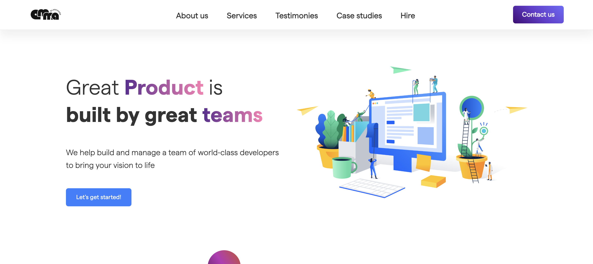

# 🎨 Figma to HTML - Software Company Landing Page

🔗 [Voir la démo en ligne](https://emma-blnch.github.io/Figma-to-HTML/)

## 📌 Description
Ce projet est une **intégration HTML/CSS/JS** d'une maquette **Figma**, inspirée d'un site de présentation pour une entreprise tech.

L'objectif était de **reproduire fidèlement** la maquette et d'ajouter des animations pour améliorer l'UX/UI.

## 🚀 Technologies utilisées
- **HTML5** - Structure du site
- **CSS3** (Flexbox, Grid, animations)
- **JavaScript** (animations, carrousel, interactions)
- **GitHub Pages** - Hébergement du projet

## ✨ Fonctionnalités
✔ Navigation fluide avec scroll animé  
✔ Effets au survol et animations CSS  
✔ Carrousel automatique des services et partenaires   
✔ Responsive design (mobile-friendly)  

## 📸 Aperçu

## 🎨 Maquette Figma

Vous pouvez retrouver la maquette à la source du projet sous le nom "SoftwareCompanyWebsite.png".

## 📂 Installation locale
Si vous souhaitez tester le projet en local :
1. Clonez ce dépôt : git clone https://github.com/Emma-blnch/Figma-to-HTML.git
2. Ouvrez `index.html` dans votre navigateur.
